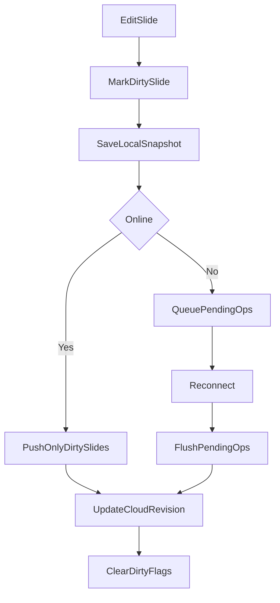

# Sincronizacion nube/local para slides

## Objetivo

Definir de forma clara como funciona hoy la persistencia de presentaciones entre local y nube (web y desktop), identificar los problemas de costo/rendimiento actuales, y establecer una arquitectura incremental para sincronizar solo slides modificados con soporte offline.

## Alcance

- Presentaciones (deck + slides) en editor.
- Guardado local y sincronizacion cloud.
- Resolucion de conflictos entre dispositivos.
- Estado de cambios pendientes para usuario.

No cubre en detalle autenticacion, permisos de compartido ni migraciones de Firestore fuera de lo necesario para sincronizacion diferencial.

## Arquitectura actual (AS-IS)

### 1) Persistencia local

- En desktop (Tauri), las presentaciones se guardan localmente en SQLite via `storage.ts` y comandos Tauri.
- En web, se guardan en `localStorage` como `WebPresentationRecord` por `accountScope`.
- Cada registro local puede tener metadatos cloud: `cloudId`, `cloudSyncedAt`, `cloudRevision`, `localBodyCleared`, `sharedCloudSource`.

Archivos de referencia:
- `src/services/storage.ts`
- `src/presentation/state/usePresentationManualSave.ts`
- `src/presentation/state/usePresentationSavePresentation.ts`

### 2) Flujo de guardado manual en editor

Cuando el usuario guarda:
- Se consolidan buffers de edicion del slide actual.
- Se arma el payload completo de presentacion (`topic`, `slides`, tema, narrativa, etc.).
- Si existe `currentSavedId`, se hace `updatePresentation` local.
- Si no existe, se crea nuevo guardado local (`savePresentation`) o, en web autenticada, se intenta push cloud con sesion optimista.

Esto ocurre principalmente en:
- `src/presentation/state/usePresentationManualSave.ts`
- `src/presentation/state/usePresentationSavePresentation.ts`

### 3) Flujo de sincronizacion a nube

La sincronizacion cloud usa Firestore + Firebase Storage:
- El doc principal guarda metadatos de deck (`topic`, `slideCount`, `revision`, rutas de recursos).
- Cada slide se guarda en subcoleccion `slides/{index}`.
- Recursos pesados (imagenes y diagramas grandes) se suben a Storage y se referencia su nombre en el doc principal.

Proceso de `pushPresentationToCloud`:
1. Lee revision remota y valida conflicto (`CloudSyncConflictError` si no coincide).
2. Recorre **todos** los slides, sube recursos y reescribe documentos de slide.
3. Actualiza doc principal en transaccion incrementando `revision`.
4. Limpia sobrantes de slides/recursos (best effort).

Archivo de referencia:
- `src/services/presentationCloud.ts`

### 4) Diferencia web vs desktop hoy

- **Desktop**:
  - Fuente operativa inmediata: copia local.
  - Puede auto-sincronizar a cloud despues de guardar (`autoCloudSyncOnSave`).
  - Puede quedarse solo en nube con `localBodyCleared` y rehidratar luego.

- **Web**:
  - Existe copia local en `localStorage`, pero flujo prioriza trabajo conectado a cloud cuando hay sesion.
  - Se usa `webCloudSessionRef` para `cloudId`/`cloudRevision` durante la sesion.
  - Al descargar/abrir cloud, trae contenido y actualiza estado del editor.

Archivo de referencia:
- `src/presentation/state/usePresentationCloudPresentation.ts`

### 5) Conflictos actuales

El sistema detecta conflictos por `revision` global:
- Si revision remota difiere de la esperada, lanza conflicto.
- El usuario puede optar por:
  - Traer remoto (sobrescribe local).
  - Forzar local (`force: true`) y sobrescribir nube.

Resultado: hay control de conflicto a nivel deck, pero no granularidad por slide.

### 6) Estado visual actual en Home

Las tarjetas muestran:
- `Solo local`
- `En la nube`
- `En la nube sin copia local` (rehidratable)
- `Compartida` (copia local derivada)

Archivo de referencia:
- `src/components/home/PresentationStorageBadge.tsx`

## Problemas actuales

### 1) Envio completo en cada sync

Aunque cambie un solo slide, el push recorre y reescribe todos los slides. Esto incrementa:
- Operaciones de escritura (Firestore).
- Subidas y lecturas de recursos.
- Tiempo de sincronizacion percibido.

### 2) Sin tracking persistente de slides modificados

No hay `dirtySlideIds` o cola de cambios por slide persistida entre sesiones. El sistema tiene estado de guardado global (`saveMessage`, `isSaving`) pero no inventario preciso de pendientes por slide.

### 3) Visibilidad limitada para el usuario

No hay señal clara en sidebar/home de:
- Que slides estan pendientes de sincronizar.
- Cuales estan en conflicto.
- Cuales se guardaron solo local por falta de red.

### 4) Costos y rendimiento

Sin sincronizacion diferencial:
- Aumentan costos operativos (writes/storage/network).
- Se penaliza decks grandes.
- Empeora UX en conexiones inestables.

## Arquitectura objetivo (TO-BE)

## Principios

- Fuente de verdad: nube cuando hay conectividad y sesion valida.
- Continuidad operativa: local siempre disponible para editar (desktop y web).
- Sincronizacion diferencial por slide.
- Conflicto explicito y resoluble con impacto minimo.

### Modelo de estado propuesto

Agregar estado local por presentacion:
- `lastSyncedRevision: number`
- `syncStatus: "synced" | "pending" | "offline" | "conflict"`
- `dirtySlideIds: string[]` (ids logicos de slides modificados)
- `pendingOps` (opcional para fases avanzadas): cola de operaciones pendientes por slide

Metadatos por slide (local y/o cloud):
- `contentHash` (hash estable del payload relevante del slide)
- `updatedAt`
- `lastSyncedAt` (local)

En cloud:
- Mantener `revision` global del deck.
- Mantener subcoleccion `slides/{index}` (o `slides/{slideId}` en futura migracion).
- Guardar `contentHash` por slide para reconciliacion/diagnostico.

### Flujo objetivo

1. Usuario edita slide.
2. Sistema marca slide como dirty (`dirtySlideIds`).
3. Guarda snapshot local inmediato (para recuperacion rapida).
4. Si hay red:
   - Empuja solo slides dirty + patch de metadatos de deck.
   - Si sync exitoso, limpia dirty de esos slides y actualiza revision.
5. Si no hay red:
   - Mantiene dirty y `syncStatus=offline`.
   - Reintenta en reconexion.

### Politica de conflicto propuesta

Base: seguir usando `revision` global para coherencia.

Al detectar conflicto:
- Comparar `dirtySlideIds` locales contra slides cambiados remotamente (por hash/updatedAt).
- Si no colisionan, intentar merge automatico de cambios no superpuestos.
- Si colisionan:
  - Opcion A: usar remoto para esos slides.
  - Opcion B: forzar local para esos slides.
  - Opcion C: revision manual slide por slide (fase posterior).

## Diferencia esperada desktop vs web

- **Desktop**:
  - Mantener copia local completa para apertura rapida.
  - Permitir modo offline completo.
  - Al reconectar, flush de `dirtySlideIds`.

- **Web**:
  - Mantener cache local util para continuidad corta (sesion/recarga).
  - Priorizar cloud al abrir decks para evitar divergencia larga.
  - Soportar offline temporal con cola corta de pendientes.

## Roadmap incremental (sin romper compatibilidad)

### Fase 1 - Instrumentacion de cambios por slide

Objetivo:
- Detectar y persistir slides modificados localmente.

Cambios:
- Agregar `dirtySlideIds` y `syncStatus` en metadata local.
- Marcar dirty en mutaciones de slide.
- Limpiar dirty solo tras save/sync exitoso segun caso.

Resultado esperado:
- Se sabe exactamente que slides estan pendientes.

### Fase 2 - Push diferencial cloud

Objetivo:
- Modificar `pushPresentationToCloud` para aceptar modo delta.

Cambios:
- Enviar solo slides dirty.
- Actualizar `slideCount` y metadatos deck cuando aplique.
- Mantener compatibilidad con full sync como fallback.

Resultado esperado:
- Menos writes y menor latencia de sync.

### Fase 3 - UX de estados de sincronizacion

Objetivo:
- Hacer visible el estado de sincronizacion por slide y por deck.

Cambios:
- Indicadores en sidebar para slides dirty/offline/conflict.
- Estado agregado en home card: pendiente N slides.
- Mensajes de accion claros (sincronizar, resolver conflicto, reintentar).

Resultado esperado:
- Usuario entiende que cambio, que falta subir y por que.

### Fase 4 - Telemetria y optimizacion

Objetivo:
- Medir impacto real y ajustar.

Metricas:
- Writes por sync.
- Tiempo promedio de sync.
- Bytes transferidos por deck.
- Porcentaje de syncs diferenciales vs full.
- Tasa de conflictos.

Resultado esperado:
- Evidencia de ahorro en costo y mejora de UX.

## Riesgos y mitigaciones

- **Complejidad de merge**: mantener inicio con estrategia conservadora (conflicto explicito antes de merge automatico agresivo).
- **Inconsistencia de identificador slide**: usar id estable de slide y mapear indice actual.
- **Migracion de metadata local**: versionar esquema y proveer defaults seguros.
- **Offline prolongado**: limitar tamano de cola y priorizar feedback de usuario.

## Criterios de aceptacion

1. Si se modifica 1 slide en un deck de N, el sync debe escribir solo ese slide (mas metadatos minimos de deck).
2. Debe existir indicador visual de slides pendientes de sync.
3. Sin red, los cambios deben guardarse localmente sin perdida y marcarse como pendientes.
4. Al reconectar, el sistema debe intentar flush automatico o accion manual clara.
5. En conflicto, el usuario debe tener opcion explicita de conservar remoto o local.

## Checklist de implementacion

- [ ] Definir y persistir `dirtySlideIds` en almacenamiento local.
- [ ] Instrumentar mutaciones de slides para marcar dirty.
- [ ] Extender servicio cloud con `pushPresentationDeltaToCloud(...)`.
- [ ] Mantener fallback a `pushPresentationToCloud` completo.
- [ ] Incorporar estados `syncStatus` en store y UI.
- [ ] Mostrar indicador por slide pendiente en sidebar.
- [ ] Registrar metricas de rendimiento/costo.
- [ ] Documentar pruebas de reconexion y conflicto multi-dispositivo.
